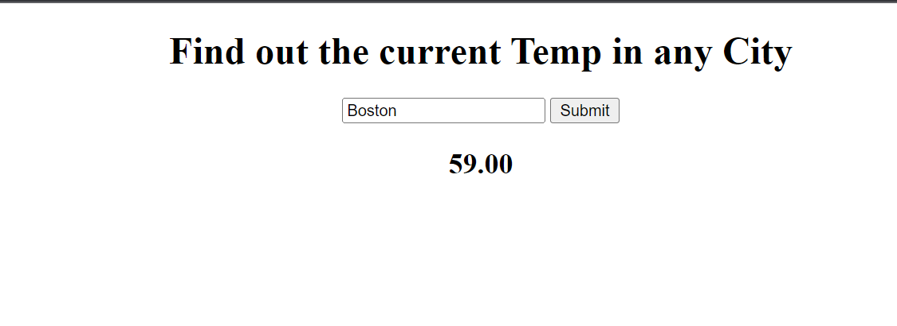

# 🌦 Project: Weather API

The user is able to enter any city in the world then click on get weather button to retrieve data for the specified locaiton. I used a API to retrive the information needed. 
