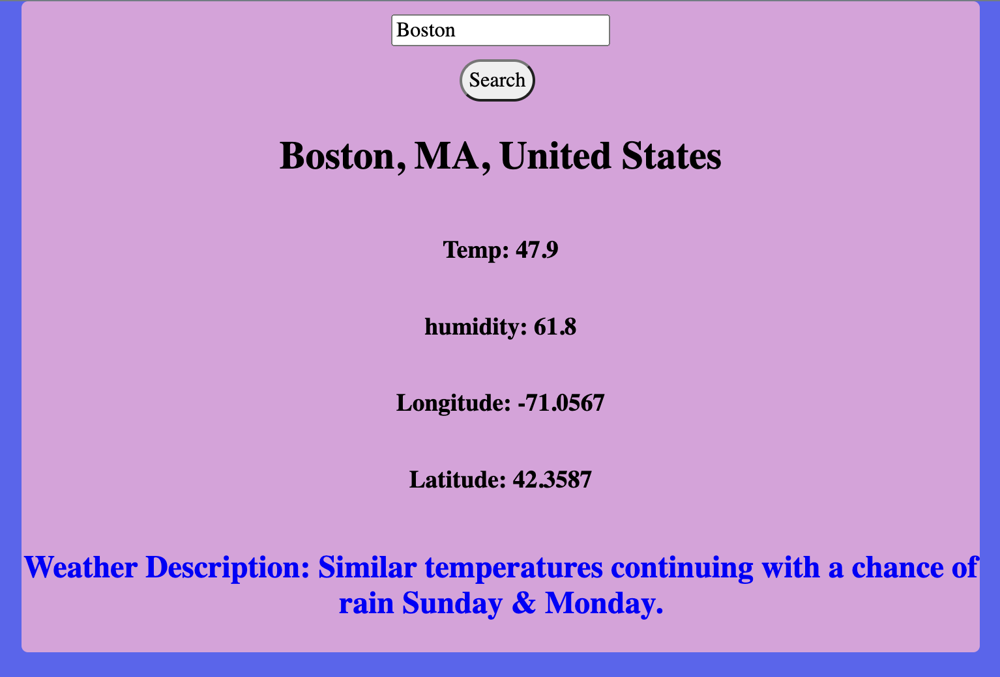

# 🌦 Project: Weather API

## Link to project 

<a href="weatherapii1.netlify.app" rel="nofollow">Visit Website</a>

### Goal: Enable your user to enter a city + country and return the temperature in Fahrenheit

