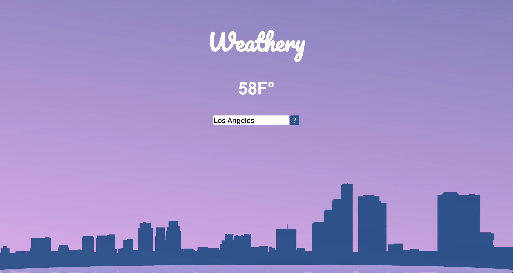

# Simple Weather API
#### Project Scope:  Input your location and click search to look up the temperature using the Open Weather Map API.
#### View here: https://svdev-weather.netlify.com

# How it was made:
#### HTML5, CSS3, Javascript E6, API, JSON

# Optimizations:
#### Enter either a city or country to retrieve weather data. 

# Lesson Learned: 
#### How to retrieve desired data from an object in an API. 

# Source: 
#### Open Weather Map: https://openweathermap.org/api
