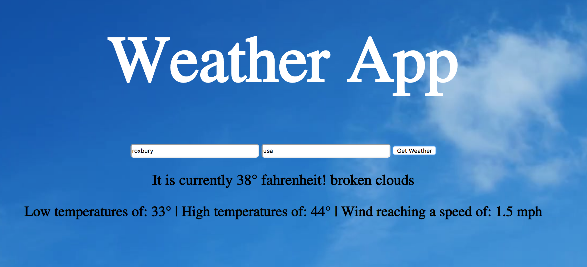

# 🌦 Project: Weather API

### Goal: Enable your user to enter a city + country and return the temperature in Fahrenheit

* **Project Title: Weather App**
  - "Weather App" is a webpage that gives you the current temperature, including the highs, lows, and the wind speed of the city you've chosen.

* **Overview**
  - It pulls data from the "Open Weather Map" API. It receives the current temperature including the highs lows. As well as the wind speed and a short description of the current weather. ex("clear skys")
  - This page was created for anyone who wants to check the weather.

* **link to project**: https://happy-ptolemy-1c711c.netlify.com

* **Image of project in use**

* **Getting Started**
  - Click on the link above
  - Enter the city and country you wish to see the weather for ex: (boston, USA)
  - click on the "Get Weather" button to find out just how chilly or warm it's going to be today :)!
