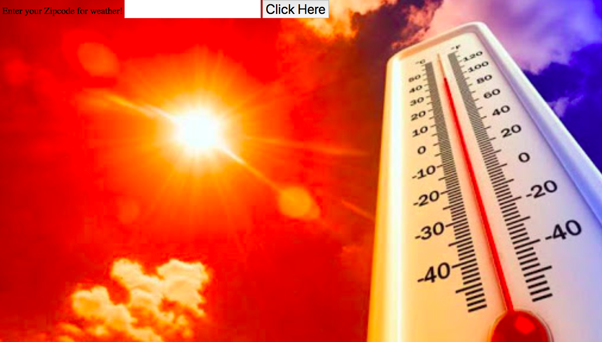

# 🌦 Project: Weather API
### Goal: Enable your user to enter a city + country and return the temperature in Fahrenheit

# Technology Used:
### HTML, Javascript, Api, css

# Optimizations
### Put in your zip code and get the temperature for your location.
