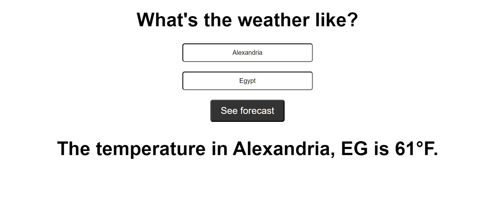

# 🌦 Project: Weather API

User is able to enter a city and country and the temperature at location is returned in Fahrenheit

Link to project: https://menahassan-weather-api.netlify.app/

# How It's Made
Tech used: HTML, CSS, JavaScript

# Lessons Learned:
Working on this project allowed me to practice using the fetch method to grab data from an API. 

Once you find a functional API, the rest of the work is fairly straightforward. You just need to map out the path to each data point you're looking to grab. This process looks slightly different for each API you're using since not all data is organized the same way but there's enough of an overlap so that you can generally get a sense of the pattern you need to follow.

