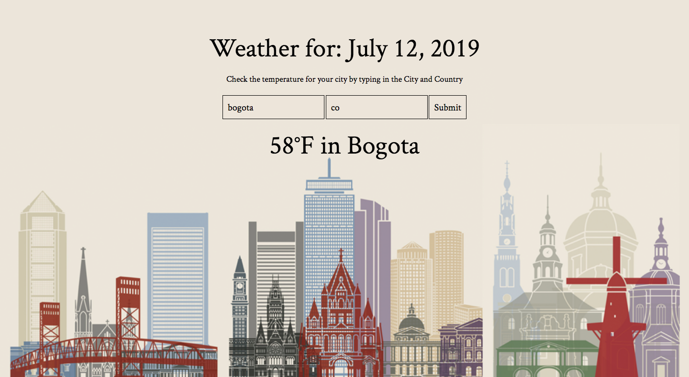

# 🌦 Project: Weather API

### Goal: Enable your user to enter a city + country and return the temperature in Fahrenheit

**View project in browser:** https://endev-weather-simple-api.netlify.com

## Design and Development:
**Tech Used** HTML, CSS, JavaScript, API, JSON: 
Using Open Weather's API, users can enter their city and country (2 letter code) to get the temperature in Farenheit.

## Reflections:
A fairly simple API call. Open Weather returns temperature in Kelvin so use conversion formula to get Farenheit.

## API Source:
**Open Weather:** https://openweathermap.org/api
