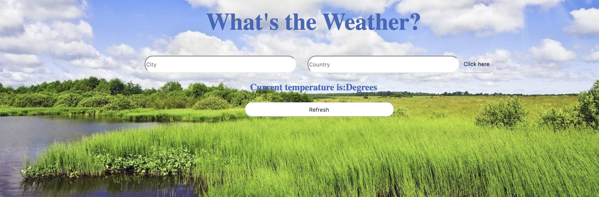

 🌦 Weather API
 
  
 Use this application to enter a city and country in order to find out what the current temperature is.
 This utilizes HTML, CSS, Javascript, and a weather API.

 View here:  https://keen-jennings-ff8231.netlify.com

