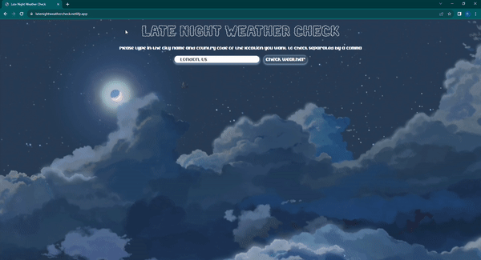

# Late Night Weather Check

A web application that allows the user to check the weather of a location based off city name and country name.

Link to project: https://latenightweathercheck.netlify.app/

## How It's Made:

Tech used: HTML, CSS, JavaScript

I used HTML to create the frame of the website. I used CSS to style the body of the webpage. Then I used JavaScript to create an event listener on the button so that when the user submits a input through the index element, it runs the function weatherReport. This function uses fetch with the Open Weather Map API. From the  API data, I pulled information from the database regarding the location that the user inputted. From the response data, I pulled the current temperature of the location, the min temp, the max temp, the feels like temp and the current condtions. I displayed the data to the DOM, and used JS to add styling to the section that hold the elements that the data is displayed to.

## Lessons Learned:

With this project, I learned how to pull  an icon from an API and show to the DOM.