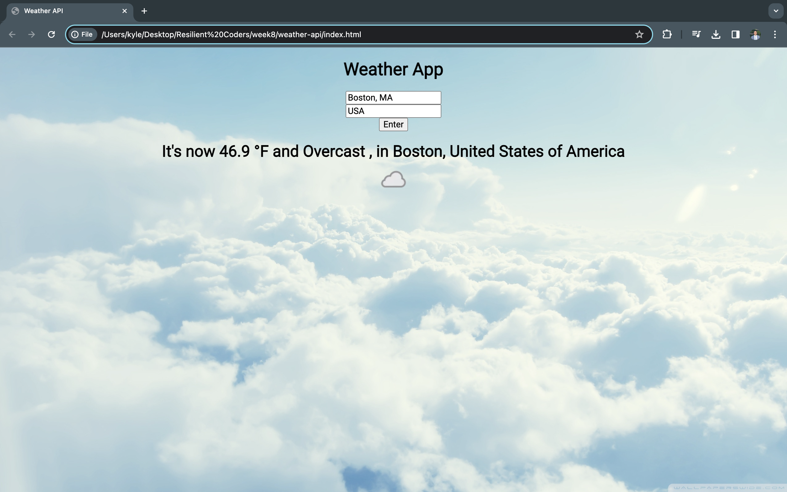

# Weather App

## Overview ☀️🌧️

This Weather App is a simple web application that allows users to check the current weather conditions for a specific location. It utilizes the WeatherAPI to fetch real-time weather data and displays it on the web page.

## Features

- Users can enter a city and country to get weather information.
- Real-time weather data, including temperature, condition, and location, is displayed.
- Weather condition icons are shown for easy visualization.
- Responsive design for different screen sizes.

## Technologies Used

- HTML: The structure of the web page.
- CSS: The styling and layout of the page.
- JavaScript: To interact with the WeatherAPI and update the content dynamically.
- WeatherAPI: Provides weather data for the specified location.