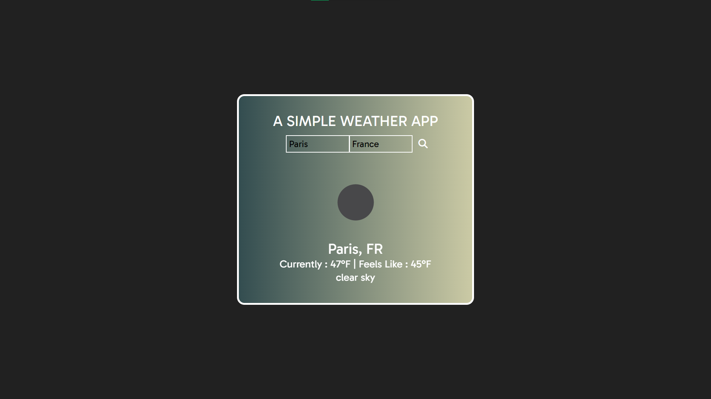

# WeatherApp ☁️🌦️

## Project Description

The WeatherApp is a simple yet efficient weather application that leverages the OpenWeatherMap API. Users can input a city and country to receive detailed information about the current weather, including temperature, "feels like" temperature, cloud conditions, and a visual representation of the current weather conditions in that area. The project aims to provide users with a fast and visually appealing way to check the weather.

## How It's Made 🛠️

- **Technologies Used:** HTML, CSS, Vanilla JavaScript, Fetch API
- **Project Organization:**
  - Organized project into folders: css (for styles), js (for JavaScript files), and the root folder containing README and index.html.
- **Dynamic Animations:**
  - Utilized `classList.add` in JavaScript to dynamically add animations to elements, enhancing the user experience.

## Lessons Learned 🧠

- **Fetch API and Template Literals:**
  - Acquired skills in using the Fetch API to retrieve weather data dynamically.
  - Enhanced knowledge of template literals for efficient string interpolation.
- **Visual Representation Challenges:**
  - Faced challenges in obtaining and displaying a picture that matches the current weather conditions.
  - Successfully utilized OpenWeatherMap's icons in the JSON object to create a visually appealing PNG file for the application.

## Getting Started 🚀

To use the WeatherApp, follow these steps:

1. Clone the repository.
2. Open the `index.html` file in your preferred web browser.
3. Enter the city and country to get the current weather information and visual representation.

Feel free to contribute, report issues, or provide feedback to make the WeatherApp even more user-friendly.