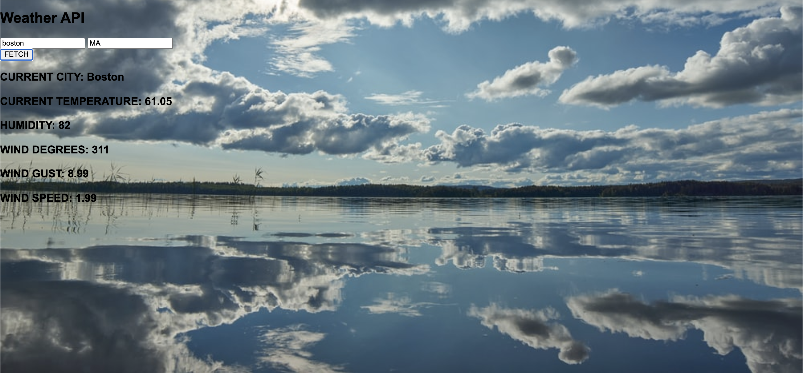

This is a simple weather API where the user will input a state and a city then clicks on the fetch button which will display the current main temperature and wind for the location returned.

Lihnk to Project: [https://juliedodev-simpleweather.netlify.app]

How It's Made:

Tech used: 
<ul>
<li>HTML</li>
<li>CSS</li>
<li>JavaScript</li>
  </ul>

Optimizations:

Lesson Learned:
I learned how to fetch data from an API which needs the city and the state parameter to fetch the temperature.
