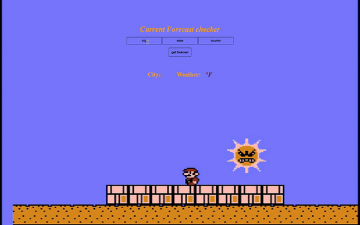

# Weather API

This app allows the user to check the weather at their desired location.

**Link to project:** https://charming-squirrel-f0ca9f.netlify.app/

## How It's Made:

**Tech used:** HTML, CSS, JavaScript

Utilziing JavaScript, the user is providing the api the search parameters to return the weather of the desired location.

<!-- ## Optimizations
*(optional)*

You don't have to include this section but interviewers *love* that you can not only deliver a final product that looks great but also functions efficiently. Did you write something then refactor it later and the result was 5x faster than the original implementation? Did you cache your assets? Things that you write in this section are **GREAT** to bring up in interviews and you can use this section as reference when studying for technical interviews! -->

## Lessons Learned:
The way I have been hiding my API keys may be outdated, exporting it is likely the standard. 

